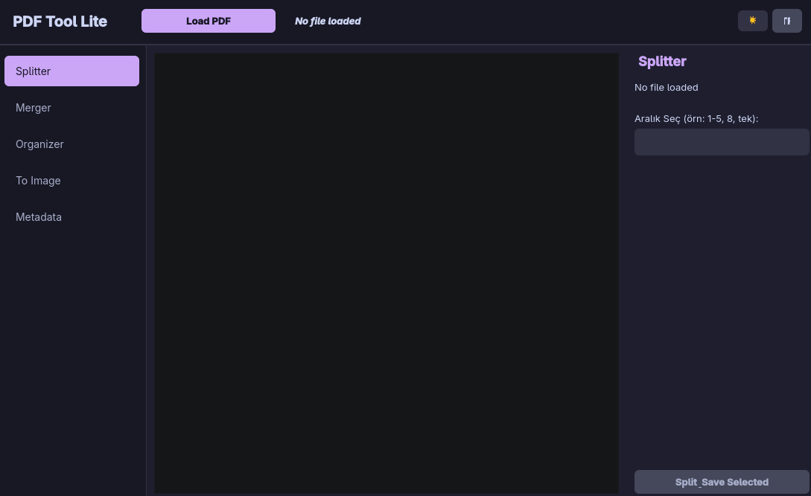
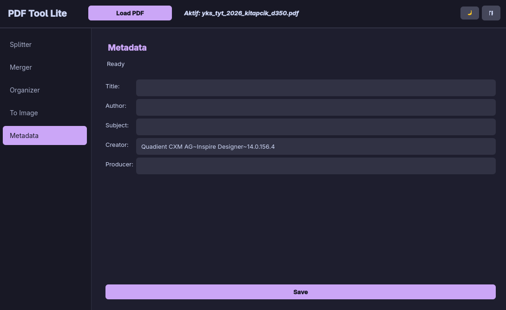

# PDF Tool Lite 🚀📑

[](LICENSE)
[](https://www.python.org/)
[](#-stand-alone-executables-no-python-required)

> Powered by `pikepdf` and `PyMuPDF`, PDF Tool Lite allows you to edit, merge, and split your PDFs losslessly on your own machine without ever uploading them to the internet. Features a modern UI, dark/light themes, and bilingual (EN/TR) support.

---

## 📸 Preview

<p align="center">
  
  
</p>
<p align="center">
  <em><b>Left:</b> Dark Mode Splitter & Organizer &nbsp; | &nbsp; <b>Right:</b> Light Mode Merger & Metadata</em>
</p>

---

## 🌟 Key Features

### 1. ✂️ Page Splitter & Organizer
- **Centralized Master PDF & OS Drag-and-Drop:** Drop any PDF file from your desktop directly onto the application window or open it via the header bar to immediately sync across all tools.
- **Bidirectional Synchronization:** Select pages visually with your mouse, and the range input automatically types `1-3, 5`. Alternatively, type keywords like `odd`, `even`, or `1-4` to instantly highlight pages on the grid.
- **Lossless Page Rotation:** Right-click any page (or press `Ctrl+R`) to rotate 90° Clockwise or Counter-Clockwise. Rotations are saved losslessly.
- **Precision Reordering:** Rearrange pages instantly using `Ctrl + Left/Right` keyboard shortcuts (or right-click menu). Press `Delete` to quickly drop unwanted pages.

### 2. 🗜️ Multi-File Merger
- **Fast & Lossless:** Drag and drop dozens of PDFs into the pool from your file manager. Reorder with intuitive ▲/▼ buttons or list dragging, then merge into a single file with one click.

### 3. 🖼️ High-Res Image Exporter
- **Custom DPI Exports:** Save selected pages losslessly as high-quality PNGs (default 300 DPI). Perfect for academic papers, presentations, and design mockups.

### 4. 🕵️ Privacy: Metadata Manager
- **Leave No Trace:** View, modify, or click **"Wipe All Metadata" (🧹)** to completely erase digital footprints (Author, Title, Creator, Producer) from your documents in a single click.

---

## 📦 Stand-Alone Executables (No Python Required)

You do **not** need Python installed on your system! Grab the pre-built single-file binary for your OS directly from the [Releases](https://github.com/hakankayaci-smilegames/pdf-tool-lite/releases) page:

| OS | Download | Instructions |
|---|---|---|
| **Windows** | `PDF-Tool-Lite-Windows.exe` | Download and double-click to run! |
| **Linux** | `PDF-Tool-Lite-Linux-x86_64.AppImage`<br>`PDF-Tool-Lite-Linux` | `chmod +x` and run standalone binary or AppImage. |
| **macOS** | `PDF-Tool-Lite-macOS.zip` | Unzip the file and launch the `pdf-tool-lite.app`. |

---

## 🛠️ Run from Source (For Developers)

### 1. Clone the Repository
```bash
git clone https://github.com/hakankayaci-smilegames/pdf-tool-lite.git
cd pdf-tool-lite
```

### 2. Create a Virtual Environment
#### Linux / macOS:
```bash
python3 -m venv .venv
source .venv/bin/activate
pip install -r requirements.txt
```
#### Windows:
```powershell
python -m venv .venv
.venv\Scripts\activate
pip install -r requirements.txt
```

### 3. Launch the Application
```bash
python src/main.py
```

---

## 🎨 UI Tips
- **Theme Toggle:** Click the ☀️/🌙 icon in the top right corner to instantly switch between the Light and premium "Catppuccin" Dark modes.
- **Language Toggle:** Use the `EN/TR` button to switch the application's interface language on the fly (real-time).

---

## 📄 License
This project is licensed under the [MIT License](LICENSE).
